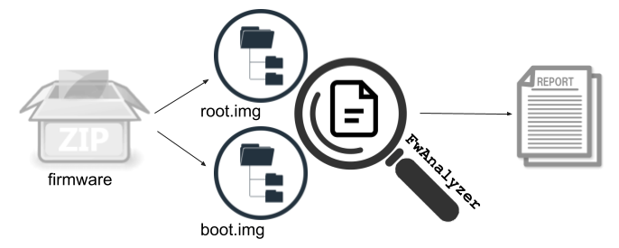

# FwAnalyzer (Firmware Analyzer)

[](https://circleci.com/gh/cruise-automation/fwanalyzer)


FwAnalyzer is a tool to analyze (ext2/3/4), FAT/VFat, SquashFS, UBIFS filesystem images,
cpio archives, and directory content using a set of configurable rules.
FwAnalyzer relies on [e2tools](https://github.com/crmulliner/e2tools/) for ext filesystems,
[mtools](https://www.gnu.org/software/mtools/) for FAT filesystems,
[squashfs-tools](https://github.com/plougher/squashfs-tools) for SquashFS filesystems, and
[ubi_reader](https://github.com/crmulliner/ubi_reader) for UBIFS filesystems.
[cpio](https://www.gnu.org/software/cpio/) for cpio archives.
SELinux/Capability support for ext2/3/4 images requires a patched version of [e2tools](https://github.com/crmulliner/e2tools/).
SELinux/Capability support for SquashFS images requires a patched version of [squashfs-tools](https://github.com/crmulliner/squashfs-tools/).



## Overview

The main idea of FwAnalyzer is to provide a tool for rapid analysis of filesystem images as part of a firmware security Q&A check suite.
FwAnalyzer takes a configuration file that defines various rules for files and directories and runs the configured checks against a given filesystem image.
The output of FwAnalyzer is a report, which contains the list of files that violate any of the rules specified in the configuration.
The report further contains meta information about the filesystem image and, if configured, information extracted from files within the analyzed filesystem.
The report is formatted using JSON so it can be easily integrated as a step in a larger analysis.

Example report:

```json
{
    "fs_type": "extfs",
    "image_digest": "9d5fd9acc98421b46976f283175cc438cf549bb0607a1bca6e881d3e7f323794",
    "image_name": "test/test.img",
    "current_file_tree_path": "test/oldtree.json.new",
    "old_file_tree_path": "test/oldtree.json",
    "data": {
        "Version": "1.2.3",
        "date1 file": "Mon Oct  1 16:13:05 EDT 2018\n"
    },
    "informational": {
        "/bin": [
                "CheckFileTree: new file: 40755 1001:1001 1024 0 SeLinux label: -"
        ],
    },
    "offenders": {
        "/bin/elf_arm32": [
                "script(check_file_elf_stripped.sh) returned=elf_arm32 is not stripped"
        ],
        "/file1": [
                "File not allowed"
        ],
        "/file2": [
                "File is WorldWriteable, not allowed",
                "File Uid not allowed, Uid = 123"
        ],
    }
}
```

## Building and Development

Follow the steps described in [Building](Building.md) to install all requirements and build FwAnalyzer.

## Using FwAnalyzer

Command line options
- `-cfg`         : string, path to the config file
- `-cfgpath`     : string, path to config file and included files (can be repated)
- `-in`          : string, filesystem image file or path to directory
- `-out`         : string, output report to file or stdout using '-'
- `-extra`       : string, overwrite directory to read extra data from (e.g. filetree, filecmp)
- `-ee`          : exit with error if offenders are present
- `-invertMatch` : invert regex matches (for testing)

Example:
```sh
fwanalyzer -cfg system_fwa.toml -in system.img -out system_check_output.json
```

Example for using custom scripts stored in the `scripts` directory:
```sh
PATH=$PATH:./scripts fwanalyzer -cfg system_fwa.toml -in system.img -out system_check_output.json
```

The [devices/](devices/) folder contains helper scripts for unpacking and dealing with specific device types and firmware package formats such as [Android](devices/android).
It also includes general configuration files that can be included in target specific FwAnalyzer configurations.

Check.py in the [devices/](devices) folder provides a universal script to effectively use FwAnalyzer, see [devices/Readme.md](devices/Readme.md) for details. This likely is how most people will invoke FwAnalyzer.

The [scripts/](scripts/) folder contains helper scripts that can be called from FwAnalyzer for file content analysis and data extraction.

## Config Options

### Global Config

The global config is used to define some general parameters.

The `FsType` (filesystem type) field selects the backend that is used to access the files in the image. The supported options for FsType are:

- `dirfs`: to read files from a directory on the host running fwanalyzer, supports Capabilities (supported FsTypeOptions are: N/A)
- `extfs`: to read ext2/3/4 filesystem images (supported FsTypeOptions are: `selinux` and `capabilities`)
- `squashfs`: to read SquashFS filesystem images (supported FsTypeOptions are: `securityinfo`)
- `ubifs`: to read UBIFS filesystem images (supported FsTypeOptions are: N/A)
- `vfatfs`: to read VFat filesystem images (supported FsTypeOptions are: N/A)
- `cpiofs`: to read cpio archives (supported FsTypeOptions are: `fixdirs`)

The FsTypeOptions allow tuning of the FsType driver.
- `securityinfo`: will enable selinux and capability support for SquashFS images
- `capabilities`: will enable capability support when reading ext filesystem images
- `selinux`: will enable selinux support when reading ext filesystem images
- `fixdirs`: will attempt to work around a cpio issue where a file exists in a directory while there is no entry for the directory itself

The `DigestImage` option will generate a SHA-256 digest of the filesystem image that was analyzed, the digest will be included in the output.

Example:
```toml
[GlobalConfig]
FsType        = "extfs"
FsTypeOptions = "selinux"
DigestImage   = true
```

Example Output:
```json
"fs_type": "extfs",
"image_digest": "9d5fd9acc98421b46976f283175cc438cf549bb0607a1bca6e881d3e7f323794",
"image_name": "test/test.img",
```

### Include

The `Include` statement is used to include other FwAnalyzer configuration files into the configuration containing the statement.
The include statement can appear in any part of the configuration.
The `-cfgpath` parameter sets the search path for include files.

Example:
```toml
[Include."fw_base.toml"]
```

### Global File Checks

The `GlobalFileChecks` are more general checks that are applied to the entire filesystem.
- `Suid`: bool, (optional) if enabled the analysis will fail if any file has the sticky bit set (default: false)
- `SuidAllowedList`: string array, (optional) allows Suid files (by full path) for the Suid check
- `WorldWrite`: bool, (optional) if enabled the analysis will fail if any file can be written to by any user (default: false)
- `SELinuxLabel`: string, (optional) if enabled the analysis will fail if a file does NOT have an SeLinux label
- `Uids` : int array, (optional) specifies every allowed UID in the system, every file needs to be owned by a Uid specified in this list
- `Gids` : int array, (optional) specifies every allowed GID in the system, every file needs to be owned by a Gid specified in this list
- `BadFiles` : string array, (optional) specifies a list of unwanted files, allows wildcards such as `?`, `*`, and `**` (no file in this list should exist)
- `BadFilesInformationalOnly` : bool, (optional) the result of the BadFile check will be Informational only (default: false)
- `FlagCapabilityInformationalOnly` : bool, (optional) flag files for having a Capability set as Informational (default: false)

Example:
```toml
[GlobalFileChecks]
Suid          = true
SuidAllowedList = ["/bin/sudo"]
SELinuxLabel  = false
WorldWrite    = true
Uids          = [0,1001,1002]
Gids          = [0,1001,1002]
BadFiles      = ["/file99", "/file1", "*.h"]
```

Example Output:
```json
"offenders": {
  "/bin/su": [ "File is SUID, not allowed" ],
  "/file1":  [ "File Uid not allowed, Uid = 123" ],
  "/world":  [ "File is WorldWriteable, not allowed" ],
}
```

### Link Handling

With links we refer to soft links.
Links can point to files on a different filesystem, therefore, we handle links in a special way.
Link handling requires a patched version of e2tools:

- [e2tools](https://github.com/crmulliner/e2tools/tree/link_support) with link support

`FileStatCheck` will handle links like you would expect it.
However if `AllowEmpty` is `false` and the file is a link the check fails.

All other checks and dataextract will fail if the file is a link.
Those checks need to be pointed to the actual file (the file the link points to).

### File Stat Check

The `FileStatCheck` can be used to model the metadata for a specific file or directory.
Any variation of the configuration will be reported as an offender.

- `AllowEmpty` : bool, (optional) defines that the file can have zero size will cause error if file is link (default: false)
- `Uid` : int, (optional) specifies the UID of the file, not specifying a UID or specifying -1 will skip the check
- `Gid` : int, (optional) specifies the GID of the file, not specifying a GID or specifying -1 will skip the check
- `Mode` : string, (optional) specifies the UN*X file mode/permissions in octal, not specifying a mode will skip the check
- `SELinuxLabel` : string, (optional) the SELinux label of the file (will skip the check if not set)
- `LinkTarget` : string, (optional) the target of a symlink, not specifying a link target will skip the check. This is currently supported for `dirfs`, `squashfs`, `cpiofs`, `ubifs`, and `extfs` filesystems.
- `Capability` : string array, (optional) list of capabilities (e.g. cap_net_admin+p).

- `Desc` : string, (optional) is a descriptive string that will be attached to the report if there is a failed check
- `InformationalOnly` : bool, (optional) the result of the check will be Informational only (default: false)

Example:
```toml
[FileStatCheck."/etc/passwd"]
AllowEmpty = false
Uid        = 0
Gid        = 0
Mode       = "0644"
Desc       = "this need to be this way"
```

Example Output:
```json
"offenders": {
  "/file2": [ "File State Check failed: size: 0 AllowEmpyt=false : this needs to be this way" ],
}
```

### File Path Owner Check

The `FilePathOwner` check can be used to model the file/directory ownership for a entire tree of the filesystem. The check fails if any file or directory with in the given directory is not owned by the specified `Uid` and `Gid`  (type: int).

Example:
```toml
[FilePathOwner."/bin"]
Uid = 0
Gid = 0
```

Example Output:
```json
"offenders": {
  "/dir1/file3": [ "FilePathOwner Uid not allowed, Uid = 1002 should be = 0",
                   "FilePathOwner Gid not allowed, Gid = 1002 should be = 0" ],
}
```

### File Content Check

The `FileContent` check allows to inspect the content of files. The content of
a file can be check using four different methods. The file content check can be
run in non enforcement mode by setting `InformationalOnly` to true (default is false).
InformationalOnly checks will produce informational element in place of an
offender.

#### Example: Regular Expression on entire file body

- `File` : string, the full path of the file
- `RegEx` : string, posix/golang regular expression
- `RegExLineByLine` : bool, (optional) apply regex on a line by line basis, matching line will be in result (default: false)
- `Match` : bool, (optional) indicate if the regular expression should match or not match (default: false)

- `Desc` : string, (optional) is a descriptive string that will be attached to failed check
- `InformationalOnly` : bool, (optional) the result of the check will be Informational only (default: false)

Example:
```toml
[FileContent."RegExTest1"]
RegEx = ".*Ver=1337.*"
Match = true
File  = "/etc/version"
```

#### Example: SHA-256 digest calculated over the file body

- `File` : string, the full path of the file
- `Digest` : string, HEX encoded digest

- `Desc` : string, (optional) is a descriptive string that will be attached to failed check
- `InformationalOnly` : bool, (optional) the result of the check will be Informational only

Example:
```toml
[FileContent."DigestTest1"]
Digest = "8b15095ed1af38d5e383af1c4eadc5ae73cab03964142eb54cb0477ccd6a8dd4"
File   = "/ver"
```

Example Output:

```json
"offenders": {
  "/ver": [ "Digest (sha256) did not match found = 44c77e41961f354f515e4081b12619fdb15829660acaa5d7438c66fc3d326df3 should be = 8b15095ed1af38d5e383af1c4eadc5ae73cab03964142eb54cb0477ccd6a8dd4." ],
}
```

#### Example: Run an external script passing the filename to the script

The file is extracted into a temp directory with a temp name before the script is executed.
The check produces an offender if the script produced output on stdout or stderr.

- `File` : string, the full path of the file or directory
- `Script` : string, the full path of the script
- `ScriptOptions` : string array, (optional) the first element allows to define a pattern containing wildcards like `?`, `*`, and `**` that is applied to filenames if present it will only check files that match the pattern, this is mostly useful when running the script on a directory. Arguments can be passed to the script using the second and following elements.
- `File` : string, the full path of the file, if the path points to a directory the script is run for every file in the directory and subdirectories

- `Desc` : string, (optional) is a descriptive string that will be attached to failed check
- `InformationalOnly` : bool, (optional) the result of the check will be Informational only (default: false)

If the `--` is present it indicates that the next argument is from the `ScriptOptions[1..N]`. The script is run with the following arguments:

```
<tmp filename> <original filename> <uid> <gid> <mode in octal> <selinux label or "-" for no label> [--] [script argument 1] ... [script argument N]
```

Example:
```toml
[FileContent."ScriptTest1"]
Script = "check_file_x8664.sh"
File   = "/bin"
```

Example Output:
```json
"offenders": {
  "/bin/elf_arm32": [ "script(check_file_x8664.sh) returned=elf_arm32 not a x86-64 elf file" ],
}
```

#### Json Field Compare

- `File` : string, the full path of the file
- `Json` : string, the field name using the dot (.) notation to access a field within an object with a colon (:) separating the required value. All types will be converted to string and compared as a string. Json arrays can be index by supplying the index instead of a field name.

- `Desc` : string, (optional) is a descriptive string that will be attached to failed check
- `InformationalOnly` : bool, (optional) the result of the check will be Informational only (default: false)

Example:
```toml
[FileContent."System_Arch"]
Json = "System.Arch:arm64"
File   = "/system.json"
Desc = "arch test"
```

Example Input:
```json
{
  "System": {
    "Version": 7,
    "Arch": "arm32",
    "Info": "customized"
  }
}

Example Output:

```json
"offenders": {
  "/system.json": [ "Json field System.Arch = arm32 did not match = arm64, System.Arch, arch test" ],
}
```

### File Compare Check

The `FileCmp` (File Compare) check is a mechanism to compare a file from a previous 
run with the file from the current run. The main idea behind this check is to provide
more insights into file changes, since it allows comparing two versions of a file rather than
comparing only a digest.

This works by saving the file as the `OldFilePath` 
(if it does not exist) and skipping the check at the first run. In consecutive runs
the current file and the saved old file will be copied to a temp directory. The script will
be executed passing the original filename, the path to the old file and the path to the current file
as arguments. If the script prints output the check will be marked as failed.

- `File` : string, the full path of the file
- `Script`: string, path to the script
- `ScriptOptions`: string array, (optional) arguments passed to the script
- `OldFilePath`: string, filename (absolute or relative) to use to store old file
- `InformationalOnly` : bool, (optional) the result of the check will be Informational only (default: false)

Script runs as:
```sh
script.sh <OrigFilename> <oldFile> <newFile> [--] [argument 1] .. [argument N]
```

Example:
```toml
[FileCmp."test.txt"]
File = "/test.txt"
Script = "diff.sh"
OldFilePath = "test.txt"
InformationalOnly = true
```

### File Tree Check

The `FileTree` check generates a full filesystem tree (a list of every file and directory) and compares it with a previously saved file tree. The check will produce an informational output listing new files, deleted files, and modified files.

`CheckPath` (string array) specifies the paths that should be included in the check. If CheckPath is not set it will behave like it was set to `["/"]` and will include the entire filesystem. If CheckPath was set to `[]` it will generate the file tree but will not check any files.

`OldFileTreePath` specifies the filename to read the old filetree from, if a new filetree is generated (e.g. because the old filetree does not exist yet)
the newly generated filetree file is OldFileTreePath with ".new" appeneded to it.

The `OldFileTreePath` is relative to the configuration file. This means for '-cfg testdir/test.toml' with OldTreeFilePath = "test.json" fwanalyzer will
try to read 'testdir/test.json'. The `-extra` command line option can be used to overwrite the path: '-cfg testdir/test.toml -extra test1' will try to
read 'test1/test.json'. Similar the newly generated filetree file will be stored in the same directory.

File modification check can be customized with:

- `CheckPermsOwnerChange`: bool, (optional) will tag a file as modified if owner or permission (mode) are changed (default: false)
- `CheckFileSize`: bool, (optional) will tag a file as modified is the sized changed (default: false)
- `CheckFileDigest`: bool, (optional) will tag a file as modified if the content changed (comparing it's SHA-256 digest) (default: false)
- `SkipFileDigest`: bool, (optional) skip calculating the file digest (useful for dealing with very big files, default is: false)

Example:
```toml
[FileTreeCheck]
OldTreeFilePath       = "testtree.json"
CheckPath             = [ "/etc", "/bin" ]
CheckPermsOwnerChange = true
CheckFileSize         = true
CheckFileDigest       = false
```

Example Output:
```json
"informational": {
    "/bin/bla": [ "CheckFileTree: new file: 40755 1001:1001 1024 0 SeLinux label: -" ]
}
```

### Directory Content Check

The `DirCheck` (Directory content) check specifies a set of files that are
allowed to be, or required to be, in a specified directory. Any other file or
directory found in that directory will be reported as an offender. If an
`Allowed` file isn't found, the check will pass. If a `Required` file is not
found, it will be reported as an offender.

The file entries can contain wildcards like `?`, `*`, and  `**`. The allowed patterns are described in
the [golang documentation](https://golang.org/pkg/path/filepath/#Match).

Only one `DirCheck` entry can exist per directory.

Example:
```toml
[DirContent."/home"]
Allowed = ["collin", "jon"]
Required = ["chris"]
```

### Data Extract

The `DataExtract` option allows extracting data from a file and including it in the report.
Data can be extracted via regular expression, by running an external script, or by reading a JSON object.
The extracted data can later be used by the post processing script.

The Data Extract functionality adds the data to the report as a map of key:value pairs.
The key is defined as the name of the statement or by the optional Name parameter.
The value is the result of the regular expression or the output of the script.

#### Example: Regular expression based data extraction

The output generated by the regular expression will be stored as the value for
the name of this statement, the example below is named "Version".

- `File` : string, the full path of the file
- `RegEx` : string, regular expression with one matching field
- `Name` : string, (optional) the key name

- `Desc` : string, (optional) description

Example:

The key "Version" will contain the output of the regular expression.
```toml
[DataExtract."Version"]
File   = "/etv/versions"
RegEx  = ".*Ver=(.+)\n"
Desc   = "Ver 1337 test"
```

Example Output:
```json
"data": {
  "Version": "1.2.3",
}
```

#### Example: Script-based data extraction

The output generated by the script will be stored as the value for the name of
this statement, the example below is named LastLine.

- `File` : string, the full path of the file
- `Script` :string, the full path of the script
- `ScriptOptions` : string array (optionl), arguments to pass to the script
- `Name` : string, (optional) the key name

- `Desc` : string, (optional) description

The script is run with the following arguments:

```
<tmp filename> <original filename> <uid> <gid> <mode in octal> <selinux label or "-" for no label> [--] [script argument 1] ... [script argument N]
```

Example:

The key "script_test" will contain the output of the script. The name of this statement is "scripttest"
```toml
[DataExtract.scripttest]
File   = "/etc/somefile"
Script = "extractscripttest.sh"
Name   = "script_test"
```

Example Output:
```json
"data": {
  "script_test": "some data",
}
```

#### Example: JSON data extraction

The output generated by the script will be stored as the value for
the name of this statement, the example below is named LastLine.

- `File` : string, the full path of the file
- `Json` : string, the field name using the dot (.) notation to access a field within an object

- `Name` : string, (optional) the key name
- `Desc` : string, (optional) description

Example:

The key "OS_Info" will containt the content of the Info field from the System object from /etc/os_version.json below.
```json
{
  "System": {
    "Version": 7,
    "Arch": "arm32",
    "Info": "customized"
  }
}
```

```toml
[DataExtract.OS_Info]
File   = "/etc/os_version.json"
Json   = "System.Info"
Name   = "OSinfo"
```

Example Output:
```json
"data": {
  "OSinfo": "customized",
}
```

Json arrays can be indexed by supplying the index instead of a field name.

#### Example: Advanced usage

The `DataExtract` statement allows multiple entries with the same Name (the same key).
This can be useful for configuring multiple ways to extract the same information.
The first data extract statement that produces valid output will set the value for the given key.
This is supported for both regular expressions and scripts and a mixture of both.

The example below shows two statements that will both create the key value pair for the key "Version".
If "1" does not produce valid output the next one is tried, in this case "2".

Example:

```toml
[DataExtract."1"]
File  = "/etc/versions"
RegEx = ".*Ver=(.+)\n"
Name  = "Version"

[DataExtract."2"]
File  = "/etc/OSVersion"
RegEx = ".*OS Version: (.+)\n"
Name  = "Version"
```

# License

Copyright 2019-present, Cruise LLC

Licensed under the [Apache License Version 2.0](LICENSE) (the "License");
you may not use this project except in compliance with the License.

Unless required by applicable law or agreed to in writing, software
distributed under the License is distributed on an "AS IS" BASIS,
WITHOUT WARRANTIES OR CONDITIONS OF ANY KIND, either express or implied.
See the License for the specific language governing permissions and
limitations under the License.

# Contributions

Contributions are welcome! Please see the agreement for contributions in
[CONTRIBUTING.md](CONTRIBUTING.md).

Commits must be made with a Sign-off (`git commit -s`) certifying that you
agree to the provisions in [CONTRIBUTING.md](CONTRIBUTING.md).
